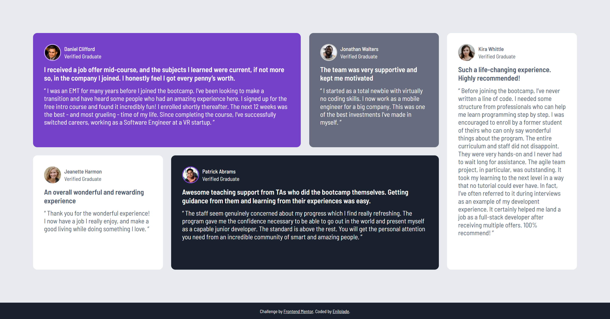

# Frontend Mentor - Testimonials grid section solution

This is a solution to the [Testimonials grid section challenge on Frontend Mentor](https://www.frontendmentor.io/challenges/testimonials-grid-section-Nnw6J7Un7). Frontend Mentor challenges help you improve your coding skills by building realistic projects.

## Table of contents

- [Overview](#overview)

  - [The challenge](#the-challenge)
  - [Screenshot](#screenshot)
  - [Links](#links)

- [My process](#my-process)

  - [Built with](#built-with)
  - [What I learned](#what-i-learned)
  - [Continued development](#continued-development)
  - [Useful resources](#useful-resources)

- [Author](#author)

## Overview

### The challenge

Users should be able to:

- View the optimal layout for the site depending on their device's screen size

### Screenshot



### Links

- Solution URL: [Github Repo](https://github.com/Enilolade/testimonial-grid)
- Live Site URL: [Add live site URL here](https://your-live-site-url.com)

## My process

### Built with

- Semantic HTML5 markup
- CSS custom properties
- Flexbox
- CSS Grid
- Mobile-first workflow

### What I learned

This project reinforced my understanding of using semantic HTML for accessibility and structure. I also learned how to:

- Create a responsive grid layout using `grid-template-areas`
- Use `CSS custom properties` for consistent theming
- Combine `Flexbox` and `Grid` effectively for layout control
- Enhance accessibility with `aria-label` and meaningful HTML structure

Example snippet:

```css
:root {
  --primary-purple: hsl(263, 55%, 52%);
  --neutral-white: hsl(0, 0%, 100%);
}
```

```html
<figure>
  <blockquote>
    <p>Great support and design!</p>
  </blockquote>
  <figcaption>
    
    <p><strong>Jane Doe</strong><br /><span>Verified Graduate</span></p>
  </figcaption>
</figure>
```

### Continued development

In future projects, I want to:

- Improve fluid typography using the `clamp()` function
- Add interactivity to similar layouts using JavaScript or React

### Useful resources

- [CSS Tricks - A Complete Guide to Grid](https://css-tricks.com/snippets/css/complete-guide-grid/) - Always a go-to for grid layout examples and explanations.
- [Smashing Magazine - Writing Accessible HTML](https://www.smashingmagazine.com/2021/03/complete-guide-accessible-front-end-components/) - Provided practical tips for improving accessibility in semantic HTML.

## Author

- Frontend Mentor - [@Enilolade](https://www.frontendmentor.io/profile/Enilolade)
